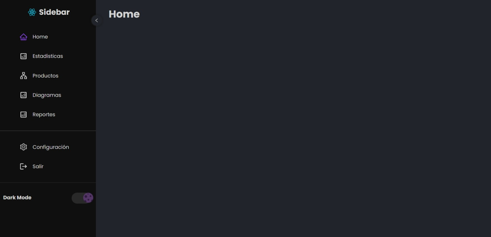

# Sidebar | Tema oscuro/claro
En esta web verás un sidebar con diferentes links con sus respectivos contenidos.

## Tecnologías
Esta página web fue realizada con las siguientes tecnologías:
- HTML5
- CSS3
- JavaScript
- React (useState, useContext)
- React Router
- React Icons
- Styled Components

## Páginas
#### Esta página web solo contiene 1 página, en esta página puedes contraer y expandir el sidebar. Además de contar con un botón que cambia el tema a oscuro/claro.

### Tema oscuro
#### Sidebar expandido

#### Sidebar reducido

### Tema claro
#### Sidebar expandido

#### Sidebar reducido

